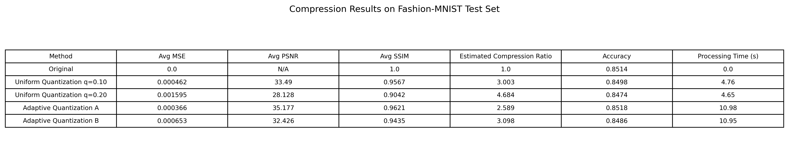
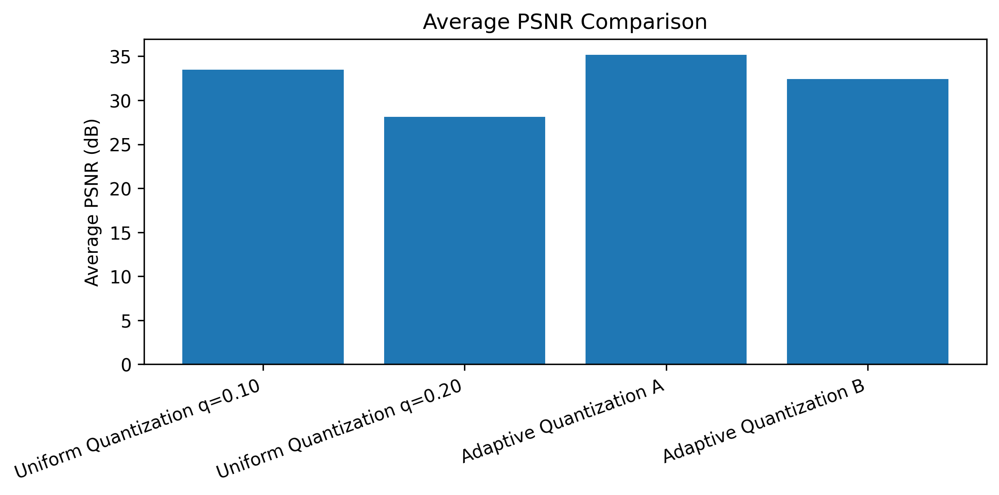
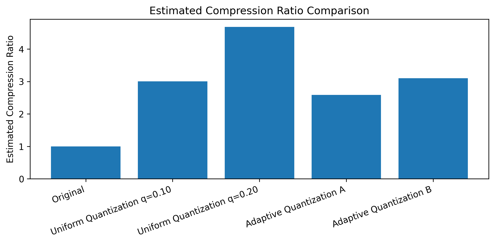
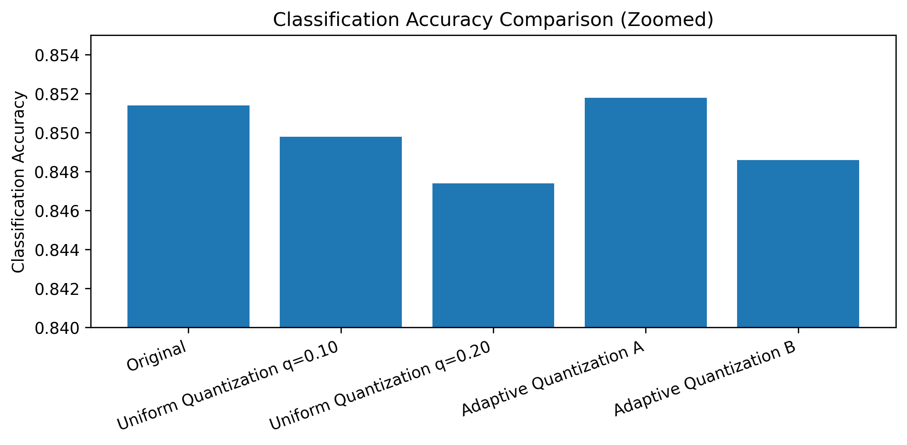
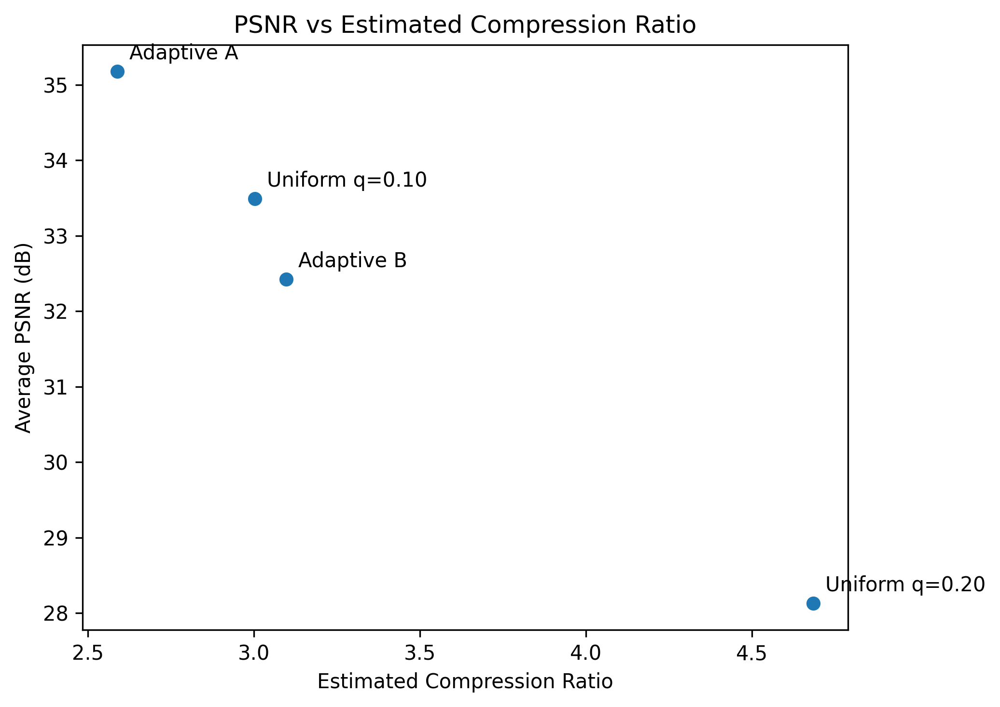
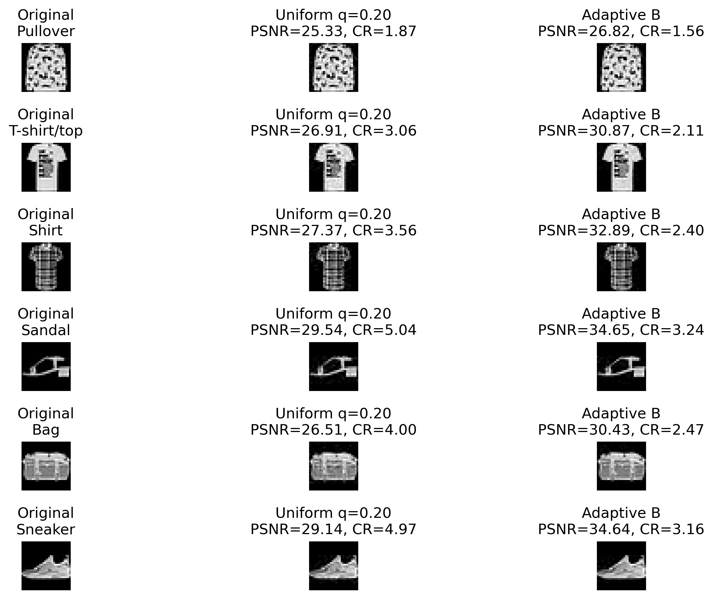
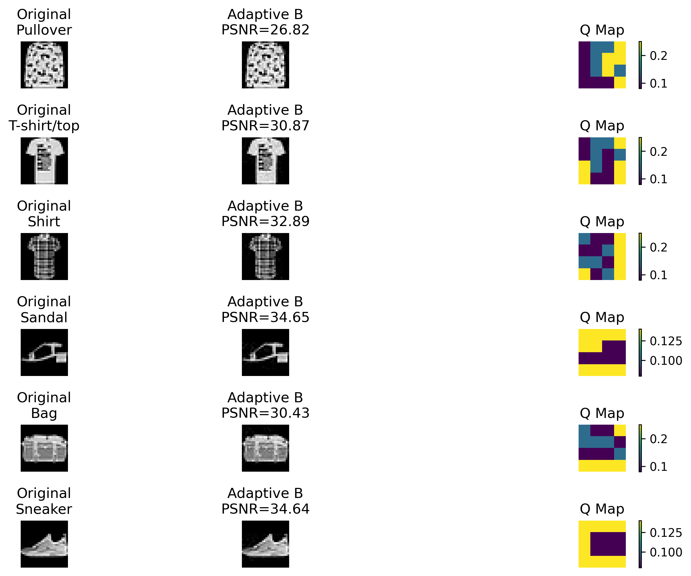

# Task-Aware Adaptive Quantization for Fashion-MNIST Image Compression

This project presents a task-aware image compression experiment using DCT-based quantization on the Fashion-MNIST dataset. Instead of evaluating compression only with pixel-level metrics, the project also measures how well compressed images preserve classification-related visual information.

The main idea is to compare uniform quantization with adaptive quantization. In the adaptive approach, each 8x8 DCT block is assigned a quantization level according to its local variance. High-variance blocks are treated as more informative and compressed less aggressively, while smoother blocks are compressed more strongly.

## Project Motivation

Classical image compression methods often apply the same compression rule across an entire image or use a uniform quantization setting.
However, not every region of an image carries the same amount of visual or task-related information.

This project explores a simple content-aware strategy:

- Preserve detail in informative image regions.
- Compress smoother regions more aggressively.
- Evaluate whether compressed images still support a classification task.

## Dataset

The project uses the Fashion-MNIST dataset.

Fashion-MNIST contains 28x28 grayscale images from 10 clothing categories, such as shirts, sneakers, bags, sandals, and coats. It is small enough for fast experimentation while still being more visually meaningful than digit-only datasets.

In this notebook, a subset is used for faster execution:

- 20,000 training images
- 5,000 test images

## Methods

### 1. Baseline CNN Classifier

A small convolutional neural network is trained on original Fashion-MNIST images. This classifier is later used to evaluate whether compressed images preserve task-relevant information.

The goal is not to build the best classifier, but to obtain a baseline model for comparing original and reconstructed images.

### 2. Uniform DCT Quantization

Fashion-MNIST images are 28x28 pixels. Since block-based DCT compression works naturally with 8x8 blocks, each image is padded to 32x32 before compression and cropped back to 28x28 after reconstruction.

The uniform method applies the same quantization parameter to all 8x8 DCT blocks.

Tested settings:

- Uniform Quantization q=0.10
- Uniform Quantization q=0.20

### 3. Adaptive DCT Quantization

The adaptive method uses block variance as a simple content-awareness criterion.

For each 8x8 block:

- High-variance blocks receive lower quantization.
- Medium-variance blocks receive medium quantization.
- Low-variance blocks receive stronger quantization.

Two adaptive settings are tested:

- Adaptive Quantization A: quality-preserving setting
- Adaptive Quantization B: more aggressive adaptive setting

## Evaluation Metrics

The project uses the following metrics:

| Metric | Purpose |
|---|---|
| MSE | Pixel-level reconstruction error |
| PSNR | Standard image reconstruction quality metric |
| SSIM | Structural similarity between original and reconstructed images |
| Estimated Compression Ratio | Proxy based on non-zero quantized DCT coefficients |
| Classification Accuracy | Task-aware evaluation using the trained CNN |
| Processing Time | Computational cost of each method |

The compression ratio reported in this project is an estimated compression ratio. It is based on the sparsity of quantized DCT coefficients and does not represent a final entropy-coded file size.

## Results

The final results show a clear trade-off between compression ratio, reconstructed image quality, and classification accuracy.

| Method | Avg MSE | Avg PSNR | Avg SSIM | Estimated Compression Ratio | Accuracy | Processing Time (s) |
|---|---:|---:|---:|---:|---:|---:|
| Original | 0.000000 | N/A | 1.0000 | 1.000 | 0.8526 | 0.00 |
| Uniform Quantization q=0.10 | 0.000462 | 33.490 | 0.9567 | 3.003 | 0.8492 | 4.82 |
| Uniform Quantization q=0.20 | 0.001595 | 28.128 | 0.9042 | 4.684 | 0.8486 | 4.78 |
| Adaptive Quantization A | 0.000366 | 35.177 | 0.9621 | 2.589 | 0.8506 | 11.25 |
| Adaptive Quantization B | 0.000653 | 32.426 | 0.9435 | 3.098 | 0.8504 | 11.19 |

## Key Observations

- Uniform Quantization q=0.20 achieved the highest estimated compression ratio, but it also caused the largest quality loss.
- Adaptive Quantization A achieved the highest PSNR and SSIM among the compressed methods.
- Adaptive Quantization B increased the estimated compression ratio compared to Adaptive A, but with a moderate decrease in quality.
- Classification accuracy remained close to the original baseline for all compressed methods.
- Adaptive methods were slower than uniform methods because they compute block-level variance and assign quantization levels separately.

## Visual Results

### Results Table



### PSNR Comparison



### Estimated Compression Ratio Comparison



### Classification Accuracy Comparison



### PSNR vs Estimated Compression Ratio



### Reconstructed Image Examples



### Adaptive Quantization Maps



## Repository Structure

```text
task-aware-adaptive-quantization/
│
├── data_compression.ipynb
├── README.md
├── requirements.txt
├── .gitignore
│
├── figures/
│   ├── results_table.png
│   ├── psnr_comparison.png
│   ├── compression_ratio_comparison.png
│   ├── accuracy_comparison.png
│   ├── psnr_vs_compression_ratio.png
│   ├── original_uniform_adaptive_examples.png
│   └── adaptive_q_maps.png
│
└── results/
    ├── compression_results_raw.csv
    └── compression_results_display.csv
```

##How to Run

Open the notebook in Google Colab or run it locally.

To install the required packages locally:
```bash
pip install -r requirements.txt
```
Then run:
```bash
jupyter notebook data_compression.ipynb
```
The notebook automatically downloads Fashion-MNIST through torchvision.datasets.FashionMNIST.

## Notes

The data/ folder is not included in the repository because the dataset is downloaded automatically.
The estimated compression ratio is not a final file-size compression ratio. It is a coefficient-sparsity-based proxy used for consistent comparison between methods.
The adaptive method is intended to show a controllable content-aware compression strategy, not to replace full production image codecs.

## Conclusion

This project demonstrates that adaptive quantization can provide a more flexible compression strategy than uniform quantization. While uniform quantization is simpler and faster, adaptive quantization allows the compression process to consider local image content and better balance visual quality, estimated compression ratio, and task-aware classification performance.

